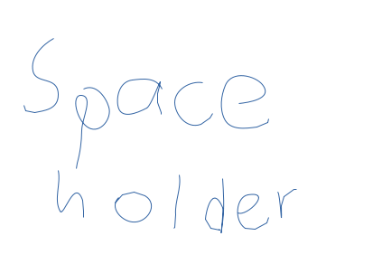

# RandomPlaceHodler for LaTeX
LaTeX package.
Available for locally installed LaTex on Unix systems and Overleaf. Tested on Ubuntu 20.04 x86_64 and Overleaf. 

Not yet available for Windows. Not compatible with TeXLive 2021 or older.

### Want to add bit of fun to your writing process? 
Insert a random image into your article by typing `\placeholder`. 

The images are selected at random from a user appointed directory, so you can use any image you like.
Use this package for drafting scientific papers or a fun calendar. Entirely up to you.
 
## User manual
For detailed instructions and all available command, please see **RandomPlaceHolder.pdf**.

Here are some simple instructions to get you started.

1. make sure your compiler is *pdfLatex* and *shell-escape* is enabled. For Overleaf, this is the default, just make sure TeXLive version is no older than 2022.
2. To use with a single LaTeX project, install the package by placing the **randomplaceholder.sty** (located in **randomplaceholder/**) next to your **main.tex**. 
*For Overleaf, try the add file from external URL option and link it to the raw content of the .sty.*
3. Include the package by adding `\usepackage{randomplaceholder}`.
4. Initialise by adding `\placeholderinit{$PATH}`. `$PATH` needs to point to a folder containing the images (and only those images) you want to use as placeholders. For example, **placeholderimage/**.
5. Write your document as normal. Use `\placeholder` to insert a placeholder image.

## To-do:
- Windows system.